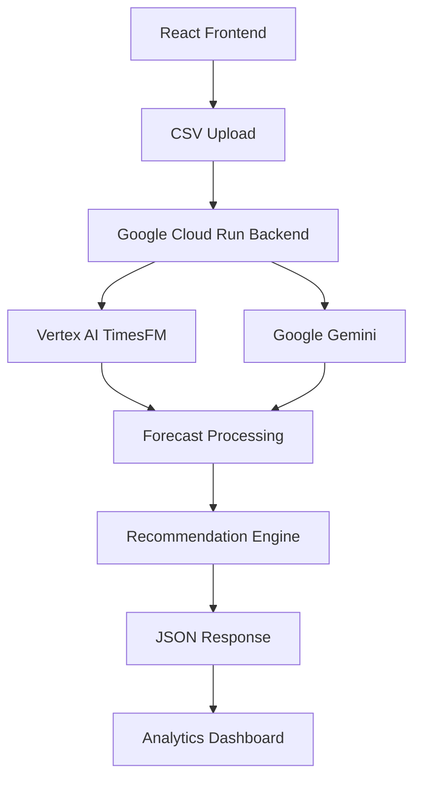
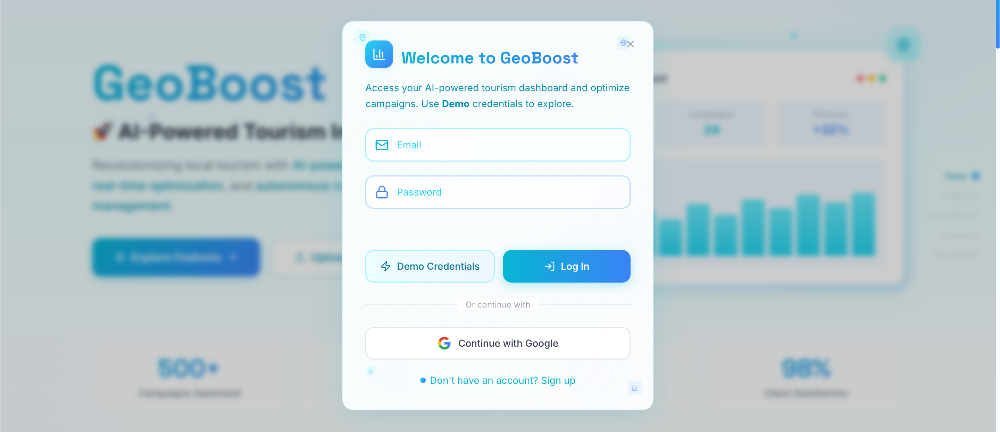
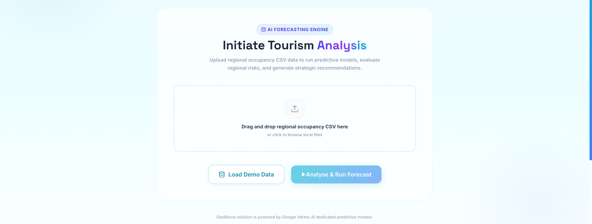
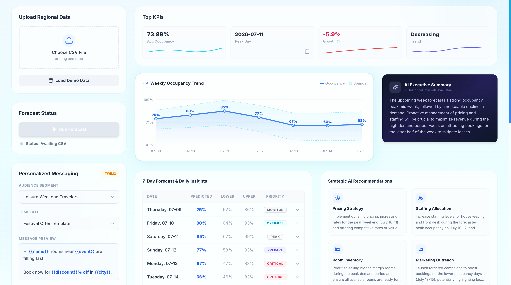

# 🌍 GeoBoost — AI-Powered Tourism Intelligence Platform

<p align="center">
  <strong>Predict Demand • Optimize Campaigns • Empower Tourism with AI</strong>
</p>

---

# 📖 Table of Contents

- [Introduction](#-introduction)
- [Problem Statement](#-problem-statement)
- [Our Solution](#-our-solution)
- [Key Features](#-key-features)
- [Architecture](#-architecture)
- [AI Pipeline](#-ai-pipeline)
- [Application Screenshots](#-application-screenshots)
- [Technology Stack](#-technology-stack)
- [Dataset](#-dataset)
- [Getting Started](#-getting-started)
- [Project Structure](#-project-structure)
- [Future Scope](#-future-scope)
- [Team](#-team)

---

# 🌎 Introduction

GeoBoost is an AI-powered tourism intelligence platform built to help **tourism boards, hotels, resorts, and local businesses** make smarter marketing decisions using predictive analytics and Generative AI.

Instead of reacting after tourists arrive, GeoBoost enables organizations to anticipate tourism demand days in advance and take proactive actions to maximize occupancy, improve customer experiences, and increase regional economic activity.

Using **Google Vertex AI TimesFM 2.5**, GeoBoost forecasts hotel occupancy trends from historical data. These forecasts are then combined with contextual tourism information and analyzed by **Google Gemini**, which transforms raw predictions into executive-level insights and strategic business recommendations.

---

# ❓ Problem Statement

Tourism demand changes constantly due to factors like:

- Public holidays
- Festivals
- Weather
- Local events
- Promotional campaigns
- Seasonal travel
- Hotel availability

Unfortunately, these insights often exist in isolated systems.

As a result,

- Hotels struggle to prepare for sudden demand spikes.
- Tourism boards launch campaigns too late.
- Local businesses miss revenue opportunities.
- Marketing budgets are spent inefficiently.

Organizations need a unified AI-powered platform capable of forecasting demand while providing actionable recommendations.

---

# 💡 Our Solution

GeoBoost combines predictive AI with Generative AI to create an end-to-end tourism decision platform.

The platform allows users to:

- Upload historical occupancy data
- Generate demand forecasts using Vertex AI TimesFM
- Visualize occupancy trends
- Understand demand drivers using Gemini
- Receive AI-generated strategic recommendations
- Coordinate campaigns across tourism stakeholders

Rather than displaying only charts, GeoBoost explains **why** demand changes and **what actions should be taken next**.

---

# ✨ Key Features

## 📈 AI Occupancy Forecasting

GeoBoost leverages **Google Vertex AI TimesFM 2.5**, Google's foundation model for time-series forecasting.

The model predicts:

- 7-Day Occupancy Forecast
- Peak Occupancy Day
- Weekly Occupancy Trend
- Confidence Bounds
- Average Forecasted Occupancy

These predictions allow businesses to prepare before demand changes occur.

---

## 🤖 AI Executive Summary

Forecast numbers alone are difficult to interpret.

GeoBoost sends forecast results to **Google Gemini**, which generates executive summaries explaining:

- Demand trends
- Occupancy changes
- Weekend surges
- Business risks
- Opportunities

The result is a report understandable by business stakeholders rather than data scientists.

---

## 📊 Interactive Dashboard

GeoBoost includes a modern analytics dashboard featuring:

- Average Occupancy
- Growth Percentage
- Peak Day
- Trend Indicator
- Weekly Forecast Graph
- Confidence Interval Visualization
- AI Executive Summary
- Daily Forecast Table
- Strategic Recommendations

The interface is designed using a modern glassmorphism UI for improved readability.

---

## 🎯 Strategic AI Recommendations

Based on forecasts and regional context, Gemini generates recommendations across multiple business areas.

### 💰 Pricing Strategy

- Dynamic pricing
- Promotional discounts
- Weekend pricing
- Revenue optimization

---

### 👨‍💼 Staffing Allocation

- Increase staffing during demand peaks
- Reduce overstaffing
- Weekend workforce planning

---

### 🏨 Room Inventory

- Prioritize premium rooms
- Allocate maintenance windows
- Optimize room availability

---

### 📢 Marketing Campaigns

- Hyper-local campaigns
- Event-based promotions
- Seasonal targeting
- Tourist outreach

---

## ✉️ Personalized WhatsApp & SMS Outreach

GeoBoost integrates a custom **WhatsApp Outreach Connector** and messaging support to target guests directly:

- **WhatsApp Account Linker**: Scan the secure QR code on-screen to pair a phone directly.
- **Personalized AI Promos**: Automatically write custom marketing copy based on the guest's booked room type and preferred travel destination (e.g., beach, mountain, city).
- **Interactive Campaign Dashboard**: Generate, preview, edit, and dispatch messages dynamically to guests when low occupancy warnings are triggered.
- **Multi-channel Coordination**: Connects hotels, local businesses, and regional tourism departments seamlessly.

---

## 📂 CSV Data Upload

Users can upload occupancy datasets containing tourism metadata including:

- Date
- Occupancy
- Hotel Tier
- Room Type
- Region
- Hotel ID
- Holiday
- Festival
- Promotion
- Weekday
- Special Events
- Discount Percentage
- Temperature

Demo datasets are also supported for quick experimentation.

---

# 🏗 Architecture



---

# 🧠 AI Pipeline

```text
Historical Tourism Data
        │
        ▼
CSV Upload
        │
        ▼
Cloud Run Backend
        │
 ┌──────────────┐
 │              │
 ▼              ▼
TimesFM      Gemini
Forecast      Analysis
 │              │
 └──────┬───────┘
        ▼
Forecast Processing
        ▼
Recommendation Engine
        ▼
Dashboard
```

---

# 📸 Application Screenshots

## 🔐 Secure Authentication



Google OAuth 2.0 authentication provides a secure and seamless login experience.

---

## 📂 CSV Upload



Users can upload historical tourism occupancy datasets or load demo datasets for instant forecasting.

---

## 📈 AI Analytics Dashboard



The dashboard provides:

- Forecast KPIs
- Weekly Occupancy Trends
- Confidence Bounds
- AI Executive Summary
- Strategic Recommendations
- Daily Occupancy Forecasts

---

# ⚙ Technology Stack

| Category | Technology |
|-----------|------------|
| Frontend | React |
| Build Tool | Vite |
| Styling | Tailwind CSS |
| Animations | Framer Motion |
| Authentication | Firebase Authentication (Google OAuth) |
| Backend | Python |
| API Hosting | Google Cloud Run |
| AI Forecasting | Vertex AI TimesFM 2.5 |
| Large Language Model | Google Gemini |
| Messaging | Twilio, WhatsApp Campaign Connector |
| Charts | Recharts |
| Deployment | Firebase Hosting |

---

# 📊 Dataset

GeoBoost uses historical hotel occupancy datasets enriched with contextual tourism metadata.

Example schema:

| Column | Description |
|---------|-------------|
| Date | Historical record date |
| Occupancy | Daily hotel occupancy (%) |
| Hotel Tier | Budget, Business, Luxury, Resort |
| Room Type | Standard, Deluxe, Suite, Penthouse |
| Region | Tourist destination |
| Holiday | Public holiday |
| Festival | Local festival |
| Promotion | Running marketing campaign |
| Weekday | Day of week |
| Special Event | Conferences, concerts, exhibitions |
| Discount Percentage | Promotional discount |
| Temperature | Daily average temperature |

---

# 🚀 Getting Started

## Clone Repository

```bash
git clone https://github.com/Officialanuj01/team_prime_GeoBoost.git

cd team_prime_GeoBoost
```

---

## Frontend

```bash
cd frontend

npm install

npm run dev
```

The frontend will be available at:

```
http://localhost:5173
```

---

## Backend

```bash
cd backend-ml

python -m venv venv

source venv/bin/activate

pip install -r requirements.txt

python app.py
```

---

# 📂 Project Structure

```
GeoBoost
│
├── frontend
│   ├── src
│   │   ├── components
│   │   ├── pages
│   │   ├── hooks
│   │   ├── assets
│   │   └── utils
│
├── backend-ml
│   ├── forecasting
│   ├── prompts
│   ├── services
│   ├── vertex
│   ├── api
│   └── utils
│
├── screenshots
│
├── README.md
│
└── requirements.txt
```

---

# 🎯 Use Cases

GeoBoost is designed for:

- 🏨 Hotels
- 🏝 Resorts
- 🌍 Tourism Boards
- 🏛 Government Tourism Departments
- 🎪 Festival Organizers
- 🛍 Local Businesses
- 🚖 Transportation Providers
- 🍽 Restaurants

---

# 🚀 Future Scope

Planned improvements include:

- Google Maps demand heatmaps
- Live weather integration
- Event scraping from public APIs
- Multi-city forecasting
- Multi-property analytics
- Revenue forecasting (RevPAR & ADR)
- Automated AI campaign generation
- Email marketing automation
- BigQuery integration
- Real-time streaming dashboards
- Mobile application support

---

# 👨‍💻 Team

Built with ❤️ by **Team DSA**

| Member | Role |
|---------|------|
| **Anuj Sahu** | Full Stack Developer |
| **Saksham Gupta** | Full Stack Developer |
| **Devraj Patil** | Full Stack Developer |

---

# 🏆 Built For

**Google Gen AI APAC Hackathon**

Powered by:

- Google Vertex AI
- TimesFM 2.5
- Gemini
- Google Cloud Run
- Firebase
- Twilio

---

<p align="center">
Made with ❤️ using Google AI to empower smarter tourism decisions.
</p>